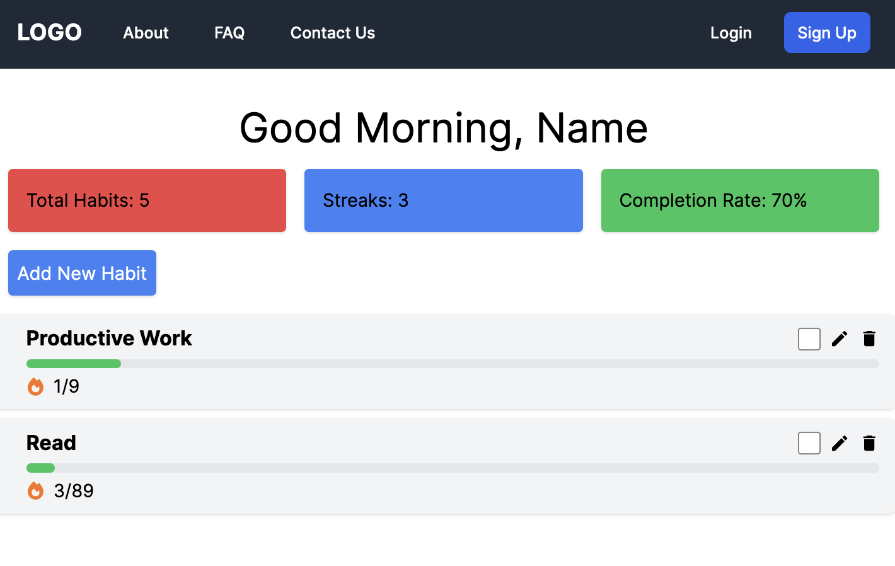

# Habit Tracker

## Overview

This project is a full-stack web application with a backend built using Node.js and Express, and a frontend developed with React and Next.js.

## Backend

The backend is responsible for handling API requests, managing user sessions, and interacting with the database.

### Key Components

- **Server Setup**: The main server file (`Backend/src/server.js`) sets up the Express app and session middleware.
- **User Authentication**: Routes for user registration, login, and logout are defined in `Backend/src/routes/authRoutes.js` and `Backend/src/routes/logoutRoute.js`.
- **Passport Configuration**: User authentication is configured using Passport.js in `Backend/src/config/auth.js`.
- **User Model**: The User model for the database is defined in `Backend/src/models/user.js`.

## Frontend

The frontend is a React application that includes several components for user interaction.

### Key Components

- **Dashboard**: The main dashboard component (`Frontend/src/app/Dashboard.tsx`) displays a greeting, summary cards, and a button for adding new habits.
- **Habit List**: The `Frontend/src/app/HabitList.tsx` component displays a list of habits with options to edit, delete, and toggle completion status.
- **Navigation Bar**: The `Frontend/src/app/Navbar.tsx` component displays the navigation bar with links to different pages and buttons for user login and registration.
- **User Registration and Login**: The `Frontend/src/app/SignupForm.tsx` and `Frontend/src/app/LoginForm.tsx` components display forms for user registration and login, respectively.

## Running the Project

To run the project, both the backend server and the frontend client need to be started:

- In the **backend directory**:
  - Run `npm install` to install dependencies.
  - Run `npm start` to start the server.
- In the **frontend directory**:
  - Run `npm install` to install dependencies.
  - Run `npm run dev` to start the client.

